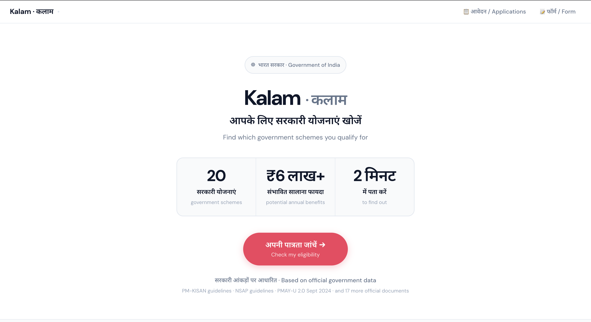
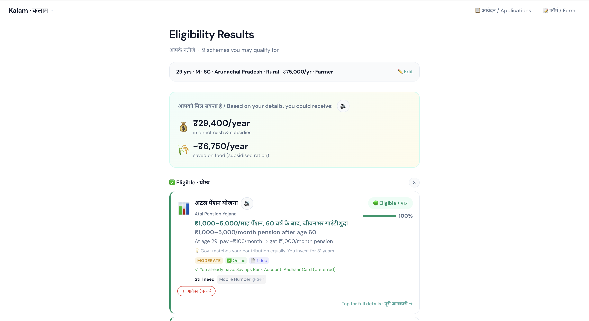
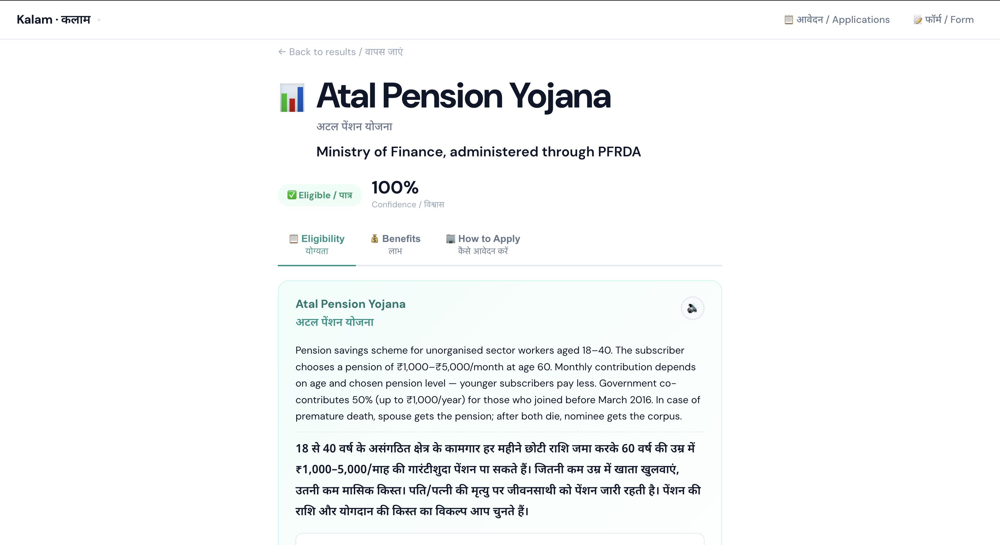
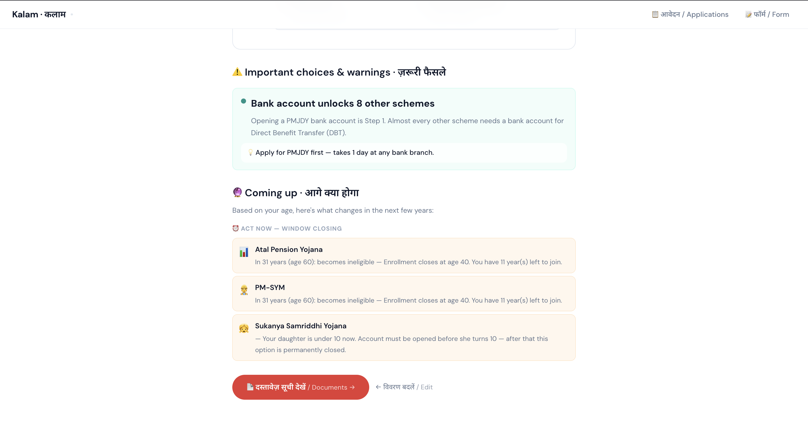
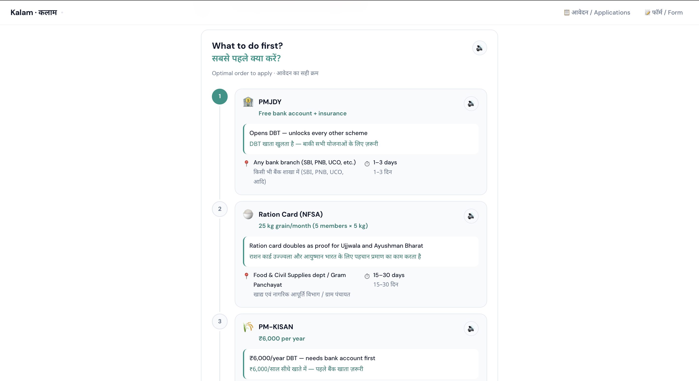
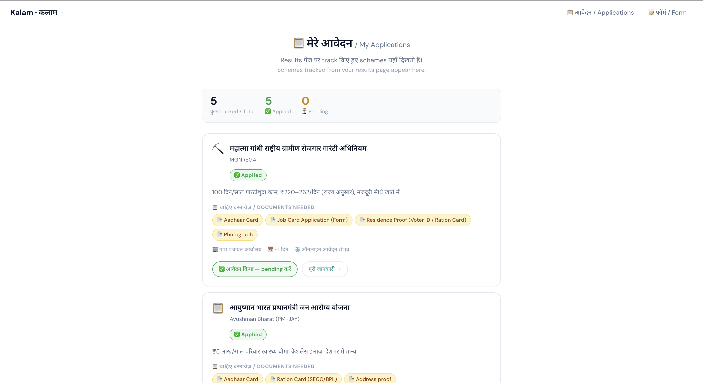

# कलम · Kalam

> **आपके लिए सरकारी योजनाएं खोजें** · Find which Indian government welfare schemes you qualify for

[](#running-tests)
[](#quick-start)
[](LICENSE)
[](https://kalam-ac7c.onrender.com)

**Two ways to check eligibility:**

- **Chat** (`/chat`) — describe your situation in Hinglish. The system asks intelligent follow-up questions, handles "pata nahi" (don't know) gracefully, and surfaces contradictions before they cause incorrect results.
- **Form** (`/details`) — a 5-step bilingual form, all fields optional.

Get personalised results across 20 central government schemes — confidence scores, benefit amounts, document checklists, Hindi audio on every card, and a step-by-step application guide.

No sign-up. No API key required. Works even with partial information.

---

## Live demo

**[https://kalam-ac7c.onrender.com](https://kalam-ac7c.onrender.com)**

> Hosted on Render free tier — may take up to 30 seconds to wake from sleep on first visit.

---

## Screenshots

### Home page

*Hindi-first landing with real-time scheme count, potential benefit total, and a single CTA. Nav: आवेदन (Applications) + फॉर्म (Form).*

### Eligibility results

*Each scheme shows a confidence bar (0–100%), rule-by-rule pass/fail breakdown, personalised benefit amount, docs you already have vs still need, and a 🔊 Hindi speak button. Grouped by: Eligible · Likely · Need info · Ineligible.*

### Scheme detail page — Atal Pension Yojana

*Full scheme description in Hindi + English. Three tabs: Eligibility (100% confidence, all rules passed), Benefits (exact amounts), How to Apply (office, helpline, portal link, Hindi office script).*

### Important choices & coming up

*Scheme interaction warnings: "Bank account unlocks 8 other schemes — apply for PMJDY first." Age-based life-event projections: APY closes at 40, Sukanya Samriddhi must open before daughter turns 10.*

### Optimal application order

*Prerequisite-aware sequencing using topological sort. Each step shows: scheme name in Hindi, why to do it first, which office to go to (with Hindi name), and estimated processing days.*

### My Applications tracker

*Track applied / pending schemes in localStorage — no login needed. Shows documents needed for each tracked scheme, office info, and benefit summary in Hindi.*

---

## Features

### Hinglish conversational chat (`/chat`)
A stateful, multi-turn chat interface where users describe their situation in natural language — no form required.

- **Hinglish NLU** — pure regex, no API. Handles Hindi, English, and mixed input. ~140 patterns covering age, income (lakhs/hazaar), state, gender, caste, occupation, land, documents, and more.
- **Question-context awareness** — "haan/nahi" answers resolve correctly because the engine tracks which question it just asked.
- **"Pata nahi" handling** — a dedicated skip button (or just type "pata nahi") skips the current question without blocking the conversation. Skipped fields show as INSUFFICIENT\_DATA in results.
- **Cross-turn contradiction detection** — e.g. "no bank account + Aadhaar linked" triggers a clarification question before results are shown.
- **Server-side session state** — profile is built up across turns server-side. The browser never needs to manage state.
- **Progress chips** — shows filled fields in real time ("Age · उम्र", "State · राज्य", …). Results CTA appears when ≥ 5 fields are collected.
- **Reset** — start a fresh conversation without refreshing the page.

```
You: "main 38 saal ka kisan hoon UP ke gaon mein, OBC, income 1.5 lakh, parivaar 5 log"
Bot: ✓ Age:38 · Income:₹1.5L/yr · State:UP · Location:Gaon · Category:OBC · Occupation:Farmer
     Kya aapke paas Aadhaar card hai?
You: haan
Bot: ✓ Aadhaar: Haan ✓   Kya aapka bank account hai?
You: pata nahi
Bot: Theek hai! Kya aapka Aadhaar bank account se linked hai?
     [Results CTA appears]
```

### Transparent eligibility engine
Every scheme evaluation is fully visible — you see each rule, whether it passed or failed, and why. Nothing is a black box.

- 20 central government schemes, 180+ individual eligibility rules
- Rule values: PASS · FAIL · AMBIGUOUS · INSUFFICIENT\_DATA
- Mandatory rules are gate conditions — any mandatory FAIL → INELIGIBLE immediately, before numeric scoring
- Ambiguous rules (e.g. "BPL-equivalent income") handled via `data/ambiguity_map.json` with annotated edge cases
- Handles partial profiles — missing fields produce INSUFFICIENT\_DATA, not false negatives

### Confidence scoring (Dempster-Shafer TBM + Bayesian shrinkage)
The confidence percentage shown on each card is not a simple pass-rate. It uses:

1. **Pignistic transform** (Smets–Shafer TBM): converts multi-valued rule mass assignments into a single probability
   ```
   raw = (PASS_weight + 0.5 × AMBIGUOUS_weight) / evaluated_weight
   ```
2. **Bayesian shrinkage** by data coverage: pulls the score toward 50% when profile is sparse
   ```
   score = (0.5 + (raw − 0.5) × coverage) × 100
   coverage = evaluated_rules / total_rules
   ```
3. Result: a sparse profile gets a wider uncertainty band than a complete one — "60% confidence" means something different for a 3-field profile vs a 15-field profile

### Hindi audio — HuggingFace MMS + Web Speech API fallback
Every scheme card, benefit line, and application step has a 🔊 speak button that reads the content aloud in Hindi.

**How it works:**
- **Primary (server-side):** [Meta MMS Hindi TTS](https://huggingface.co/facebook/mms-tts-hin) via HuggingFace Inference API (`facebook/mms-tts-hin`). Free tier, no credit card required. Set `HUGGINGFACE_API_KEY` in `.env`.
- **Fallback (client-side):** Browser Web Speech API (`hi-IN`). Zero cost, works without any API key. Prefers Google Hindi voice on Android/Chrome if available.
- Audio is cached — blob URLs stored in a JS Map so repeated taps replay instantly without re-fetching
- Rate-limited at 20 requests / 60 s per IP on the server endpoint
- Text is cleaned before TTS: ₹ → "रुपये", emojis stripped, dashes/symbols normalised
- Browser workarounds: Chrome 30 s idle bug (periodic pause/resume keepalive), iOS Safari autoplay restriction (utterance built synchronously inside user-gesture), Chrome voice-load race condition (retry on `onend` with `_started` flag)

If `HUGGINGFACE_API_KEY` is not set the server returns 503 and the client silently falls back to Web Speech — the app is fully functional either way.

### Benefit calculator — real rupee amounts
Shows exactly how much money each scheme provides, not just "eligible":

- **PM-KISAN:** ₹6,000/yr (₹2,000 × 3 instalments)
- **APY:** ₹1,000–5,000/month pension at 60, chosen at enrolment
- **PMAY-G:** ₹1,20,000 plains / ₹1,30,000 hilly/NE/island states
- **PMAY-U:** ₹1,00,000–2,50,000 depending on category (EWS/LIG/MIG)
- **Ayushman Bharat:** ₹5,00,000/yr health insurance coverage
- **NFSA:** 5 kg grain/person/month at ₹1–3/kg (value computed vs. FCI market price)
- **State-specific top-ups:** Odisha CM-KALIA ₹4,000/year additional, UP state housing supplement, etc.

Total potential annual benefit shown as a summary at the top of results.

### Bureaucratic distance — difficulty & docs
Each scheme card shows:

- **Difficulty badge:** Easy / Moderate / Involved / Complex (based on number of offices, doc complexity, processing time)
- **Documents you already have** (green chips) vs **documents still needed** (amber chips) — personalised to your profile (e.g. if you said you have Aadhaar, it's marked as already obtained)
- **Estimated processing days** per doc and total
- **Office to visit** with Hindi name (e.g. बैंक शाखा, ग्राम पंचायत)
- **Online application** flag with direct portal link where available

### Scheme interaction detector
Analyses all eligible schemes together and flags relationships:

- **Mutual exclusions:** can't hold both PMJJBY and PMSBY from separate providers simultaneously
- **Enablers (critical path):** "Open a PMJDY bank account first — it's a prerequisite for 8 other schemes (DBT requirement)"
- **Threshold risks:** income within 10% of a scheme's cut-off → flag so you know you're fragile

### Life event projector
Based on your current age, shows what changes in eligibility in the next 1–5 years:

- **Deadlines:** "APY enrolment closes at age 40 — you have 2 years left"
- **Opportunities:** "NSAP old-age pension opens at age 60 — you qualify in 1 year"
- **Time-limited windows:** "Sukanya Samriddhi must be opened before your daughter turns 10"

### Sensitivity analysis
Varies your income and age by small margins (±5–10%) and re-runs the engine to find fragile eligibility:

- "If your annual income were ₹5,000 lower you would qualify for MGNREGA's extended benefits"
- Prevents false confidence in borderline cases
- Flags both opportunities (just above a threshold) and risks (just below one)

### Optimal application order
Uses **networkx topological sort** across the prerequisite graph of all eligible schemes. Tells you:

- Which scheme to apply for first (and why — e.g. "PMJDY unlocks DBT for everything else")
- Estimated time and which office/portal for each step
- A **Hindi office-visit script** for each step: what to say, what to bring, what to ask for
- Greedy value ordering within the topological constraints (highest benefit first when no dependency ordering required)

### My Applications tracker
A private, no-login tracker for your application progress:

- Available on the **आवेदन / Applications** tab in the nav
- Stores data in `localStorage` under key `kalam_applied_v1` — never sent to a server
- Three states per scheme: (untracked) → ✅ Applied → ⏳ Pending → (clear)
- Applications page shows each tracked scheme with Hindi name, benefit summary, documents needed, office info, and a "पूरी जानकारी →" link to the full scheme detail page
- Summary bar: total tracked / applied / pending counts

---

## Scheme coverage (20 schemes)

| # | Scheme ID | Full name | Ministry | Benefit |
|---|-----------|-----------|----------|---------|
| 1 | pm\_kisan | PM Kisan Samman Nidhi | Agriculture | ₹6,000/yr cash |
| 2 | mgnrega | MGNREGA | Rural Development | 100 days guaranteed wage |
| 3 | ayushman\_bharat | Ayushman Bharat PM-JAY | Health | ₹5 lakh/yr health cover |
| 4 | pmay\_g | PMAY Gramin | Rural Development | ₹1.2–1.3 lakh house grant |
| 5 | pmay\_u | PMAY Urban | Housing & Urban | ₹1–2.5 lakh subsidy |
| 6 | pmjdy | PM Jan Dhan Yojana | Finance | Zero-balance account + insurance |
| 7 | ujjwala | Ujjwala 2.0 | Petroleum | Free LPG connection |
| 8 | nsap\_ignoaps | NSAP IGNOAPS | Rural Development | ₹200–500/month old-age pension |
| 9 | nsap\_ignwps | NSAP IGNWPS | Rural Development | ₹300/month widow pension |
| 10 | nsap\_igndps | NSAP IGNDPS | Rural Development | ₹300/month disability pension |
| 11 | apy | Atal Pension Yojana | Finance / PFRDA | ₹1,000–5,000/month at 60 |
| 12 | pm\_sym | PM Shram Yogi Maandhan | Labour | ₹3,000/month pension |
| 13 | pm\_svanidhi | PM SVANidhi | Housing & Urban | ₹10k–50k micro-credit |
| 14 | pm\_mudra | PM MUDRA | Finance | ₹50k–10 lakh business loan |
| 15 | pmegp | PMEGP | MSME | 15–35% capital subsidy |
| 16 | stand\_up\_india | Stand-Up India | Finance | ₹10 lakh–1 crore loan |
| 17 | sukanya\_samriddhi | Sukanya Samriddhi Yojana | Finance | 8.2% tax-free savings |
| 18 | pmmvy | PMMVY | Women & Child Dev | ₹5,000 maternity benefit |
| 19 | nfsa | NFSA / Ration Card | Food & Consumer Affairs | 5 kg grain/person/month |
| 20 | pm\_vishwakarma | PM Vishwakarma | MSME | ₹1–2 lakh credit + training |

---

## Architecture

```
User (Browser)
  ├─ /chat  → Hinglish chat   ─── stateful NLU ──→ /results
  └─ /details → 5-step form   ───────────────────→ /results

Conversation layer  (src/conversation/engine.py)
  ConversationState  {profile, skipped, contradictions_seen, last_question}
  _extract_fields()  pure-regex, context-aware Hinglish NLU
  detect_contradictions()  cross-turn logic checks
  _next_question()   priority-ordered follow-up queue
      │
      ▼
User fills short profile (form or chat, all fields optional)
(age · gender · state · income · occupation · caste · documents · family · land · disability · children…)
      │
      ▼
Profile Builder
  └─ Pydantic v2 validation (all fields Optional — no mandatory questions)
  └─ Unit normalisation: bigha / acre / gaj / sqft → hectares
  └─ Derived fields: income bucket, family size, doc flags
      │ UserProfile (38 optional fields)
      ▼
Rule Engine  ◄──── data/schemes/*.json   (180+ rules, zero hardcoding in Python)
      │             data/ambiguity_map.json   (edge case annotations)
      │             data/documents.json        (doc metadata)
      │             data/prerequisites.json    (dependency graph)
      │
      │ Per rule: PASS / FAIL / AMBIGUOUS / INSUFFICIENT_DATA + explanation
      ▼
Confidence Scorer
  └─ Dempster-Shafer TBM pignistic transform
  └─ Bayesian shrinkage by data coverage
  └─ Output: (float confidence, MatchStatus)
      │
      ├── Benefit Calculator       ← real amounts, state-specific top-ups
      │     └─ src/engine/benefit_calculator.py
      │
      ├── Bureaucratic Distance    ← difficulty, docs, offices, days
      │     └─ src/engine/bureaucratic_distance.py
      │
      ├── Sensitivity Analyzer     ← threshold proximity flags
      │     └─ src/engine/sensitivity.py
      │
      ├── Life Event Projector     ← age-based deadline / opportunity
      │     └─ src/engine/life_events.py
      │
      ├── Interaction Detector     ← mutual exclusions, enablers
      │     └─ src/engine/interaction_detector.py
      │
      ├── Path Optimizer           ← greedy value-first ordering
      │     └─ src/engine/path_optimizer.py
      │
      └── Prerequisite Sequencer   ← networkx topological sort
            └─ src/engine/sequencer.py
                │
                ▼
        FastAPI + Jinja2 templates
        uvicorn ASGI server
        Deployed on Render (render.yaml included)
```

---

## Quick start

### Requirements
- Python 3.11+
- No API keys required for full functionality (TTS falls back to browser if no key is set)

```bash
git clone https://github.com/VeerR13/KALAM-CBC
cd KALAM-CBC
python -m venv .venv
source .venv/bin/activate      # Windows: .venv\Scripts\activate
pip install -r requirements.txt
```

### Run the web app
```bash
uvicorn web.app:app --reload
```
Open [http://localhost:8000](http://localhost:8000)

### Run the CLI (no browser needed)
```bash
# Interactive prompt
python cli.py

# Load a saved profile
python cli.py --profile tests/fixtures/profiles/edge_02_leased_farmer.json

# Run all 10 edge-case profiles
python cli.py --test-edge-cases
```

### Run tests
```bash
pytest -v          # 158 tests, all should pass
ruff check src/ tests/   # linting
```

---

## Environment variables

All optional. The app works without any of them.

| Variable | What it enables | How to get it |
|----------|----------------|---------------|
| `HUGGINGFACE_API_KEY` | Server-side Hindi TTS via [Meta MMS](https://huggingface.co/facebook/mms-tts-hin) — natural voice | Free account at huggingface.co → Settings → Access Tokens |
| `ANTHROPIC_API_KEY` | Reserved for future AI features | anthropic.com |

Copy `.env.example` → `.env` and fill in any keys you have. Leave blank to use browser Web Speech API for audio.

---

## Deploy on Render

`render.yaml` is included. Steps:

1. Fork or connect this repo at [render.com](https://render.com) → New Web Service
2. Build command: `pip install -r requirements.txt`
3. Start command: `uvicorn web.app:app --host 0.0.0.0 --port $PORT`
4. Optionally add `HUGGINGFACE_API_KEY` in the Environment tab for server-side TTS

Live deployment: **[https://kalam-ac7c.onrender.com](https://kalam-ac7c.onrender.com)**

---

## Data

All 20 scheme JSON files in `data/schemes/` are sourced from official government PDFs, guidelines, and scheme portals. Each file has a `data_freshness` field recording the verification date. All eligibility rules, benefit amounts, required documents, helpline numbers, and portal URLs live in JSON — no eligibility logic is hardcoded in Python.

```
data/
  schemes/          # 20 JSON rule files (one per scheme)
  ambiguity_map.json      # edge case annotations
  documents.json          # document metadata (where to get, processing time)
  prerequisites.json      # scheme dependency graph
  pdfs/                   # drop official PDFs here for verification
```

---

## Project structure

```
kalam/
├── src/
│   ├── models/         # Pydantic models: UserProfile, Scheme, MatchResult
│   ├── engine/         # rule_engine, confidence, benefit_calculator,
│   │                   # bureaucratic_distance, sensitivity, life_events,
│   │                   # interaction_detector, path_optimizer, sequencer
│   ├── conversation/   # engine.py (stateful ConversationEngine + session mgr)
│   │                   # follow_up.py, contradiction.py, system_prompt.py
│   └── loader.py       # Loads and caches scheme JSON files
├── web/
│   ├── app.py          # FastAPI routes, TTS endpoint, rate limiter
│   ├── templates/      # Jinja2 HTML templates (base, details, results,
│   │                   # scheme_detail, checklist, applications, chat)
│   └── static/
│       ├── css/style.css
│       └── js/app.js   # Form navigation, TTS client, localStorage tracker
├── data/               # Scheme rules, documents, prerequisites (JSON)
├── tests/              # 158 pytest tests + 10 edge-case profile fixtures
├── cli.py              # CLI entry point
├── render.yaml         # Render deployment config
└── .env.example        # Environment variable template
```

---

## Tech stack

| Layer | Technology |
|-------|-----------|
| Language | Python 3.11+ |
| Validation | Pydantic v2 |
| Web framework | FastAPI + Jinja2 + uvicorn |
| Graph algorithms | networkx (topological sort) |
| TTS (server) | HuggingFace Inference API — `facebook/mms-tts-hin` |
| TTS (fallback) | Browser Web Speech API (`hi-IN`) |
| Frontend | Vanilla JS, no frameworks |
| Storage | localStorage (application tracker) |
| Testing | pytest (158 tests) |
| Linting | ruff |
| Hosting | Render (free tier) |
